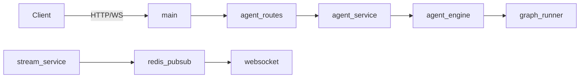

# HTTP / WebSocket 接口层

## 模块职责

对外暴露 Agent REST 与 WS；鉴权、限流、统一 ResponseVO。类比 Spring `@RestController` + `@ControllerAdvice`。

## 核心类 / 文件

- `routes/agent.py — sendMessage / loadHistory / confirmAction`
- `websocket.py — ConnectionManager + Redis Pub/Sub 下行`
- `deps.py — require_login`
- `exception_handlers.py`

## 调用链（自上而下）

1. `main.py → POST /api/agent/sendMessage → agent.py::send_message`
1. `agent.py → deps.require_login → agent_service.AgentOrchestrator.send_message`
1. `agent.py → message_service.save_user_message (MySQL)`
1. `agent.py → asyncio.create_task(_run_agent) → agent_engine.assistant_answer`
1. `stream_service.push_* → redis_service.publish_ws → websocket._topic_listener → WS 客户端`
1. `POST /api/agent/confirmAction → pending_action_service.confirm → action_execute_service → Java /api/order/*`

## 调用链图

## 外部依赖

- Redis Pub/Sub
- MySQL (message_service)
- Java Web (confirm 写操作)
- app.auth.token_service

## 说明

Python 模块：async≈CompletableFuture，dict≈Map，本文件描述模块间**调用链**，代码内 `# [zh]` 为逐行注释。

