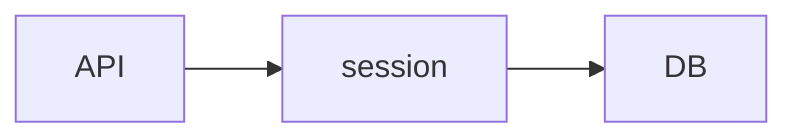

# db

## 模块职责

数据库连接池与 ORM。

## 核心类 / 文件

- `__init__.py`
- `pool.py`

## 调用链（自上而下）

1. `main.lifespan → session/get_redis → services CRUD`

## 调用链图

```mermaid
flowchart LR
  API --> session --> DB
```

## 外部依赖

- PostgreSQL/SQLAlchemy 或 MySQL
