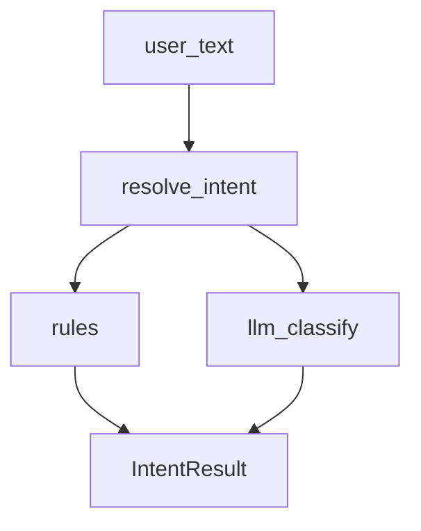

# 领域层 — 意图识别

## 模块职责

规则 + LLM 将用户输入映射为 PRODUCT_SEARCH / QUERY_ORDER / REFUND 等。类比 Java 领域服务 + 规则引擎。

## 核心类 / 文件

- `intent/types.py — IntentKind`
- `intent/rules.py — 关键词规则`
- `intent/classifier.py — resolve_intent`

## 调用链（自上而下）

1. `graph/nodes.build_context_node → classifier.resolve_intent`
1. `resolve_intent → rules 结构匹配 (优先)`
1. `resolve_intent → llm_factory.create_memory_llm (兜底分类)`
1. `结果写入 state.intent / intent_data → 影响 prompt 与工具强制策略`

## 调用链图

## 外部依赖

- memory LLM
- utils/order_ids
- utils/product_consult

## 说明

Python 模块：async≈CompletableFuture，dict≈Map，本文件描述模块间**调用链**，代码内 `# [zh]` 为逐行注释。

