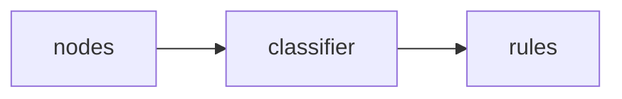

# domain/intent

## 模块职责

意图识别子域：规则 + LLM 分类。

## 核心类 / 文件

- `__init__.py`
- `classifier.py`
- `rules.py`
- `types.py`

## 调用链（自上而下）

1. `build_context → classifier.resolve_intent → rules/LLM`

## 调用链图

## 外部依赖

- LLM
