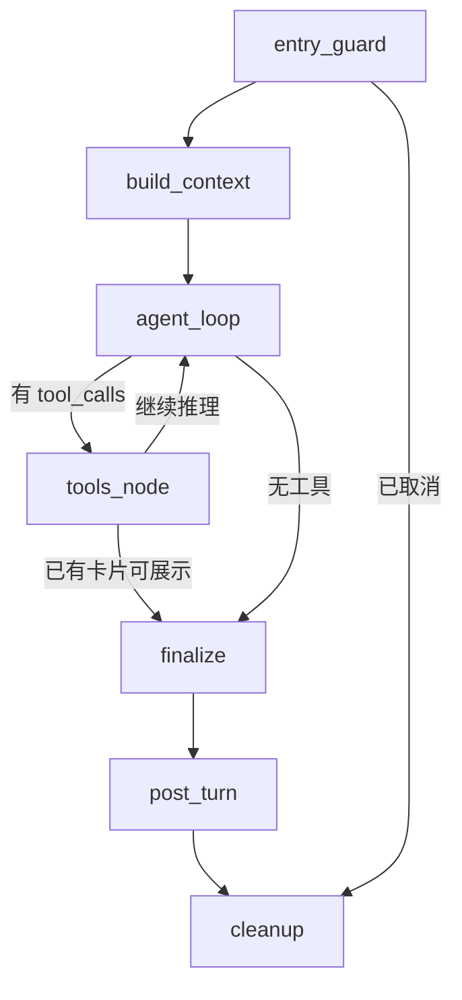

# LangGraph Agent 状态机（给 Java 初级）

## 模块职责

编排**一次**智能客服对话的完整生命周期。  
类比：Spring StateMachine / Camunda 流程定义 + 各 ServiceTask 实现。

- **连线**：`builder.py`
- **上下文 DTO**：`state.py`
- **启动/续跑**：`runner.py`
- **每个工序**：`nodes.py`
- **断点**：`checkpoint/redis_saver.py`

更完整的全栈导读：[`docs/智能客服-Java开发者导读.md`](../../docs/智能客服-Java开发者导读.md)

## 拓扑

## 调用链（自上而下）

1. `agent_engine.assistant_answer` → `runner.run_agent_graph` → `get_compiled_graph().ainvoke`
2. `entry` → `build_context` → `agent_loop` ⇄ `tools` → `finalize` → `post_turn` → `cleanup`
3. 工具：`mcp_tool_router` → MCP`:7060` → `mcp_tools_service` → Java `/internal` 或 Redis 提案

## 外部依赖

Redis（checkpoint + 推送）、LLM、MCP 进程、MySQL（消息与 resume 判断）

## Python ↔ Java

| 概念 | Java 直觉 |
|------|-----------|
| `async def` 节点 | 异步 Service 方法 |
| `state` dict | 流程 Context |
| `route` | 下一状态枚举 |
| `ainvoke` | 启动流程实例 |
