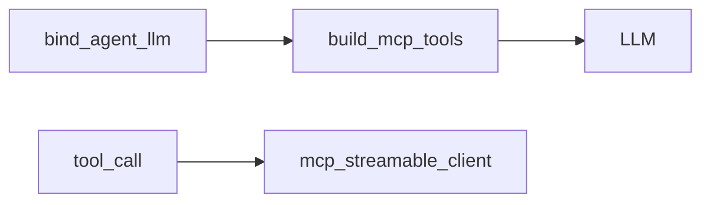

# MCP 工具 Schema（Agent 进程内）

## 模块职责

为 LangChain 提供 StructuredTool 定义；实际执行转发到独立 MCP 进程。类比 Feign Client 接口定义。

## 核心类 / 文件

- `tools.py — build_mcp_tools / Pydantic Args`

## 调用链（自上而下）

1. `agent_runtime.bind_agent_llm → build_mcp_tools → llm.bind_tools`
1. `LLM 产出 tool_call → mcp_streamable_client.call_tool (非本地 func)`

## 调用链图

## 外部依赖

- MCP Server 独立进程

## 说明

Python 模块：async≈CompletableFuture，dict≈Map，本文件描述模块间**调用链**，代码内 `# [zh]` 为逐行注释。

