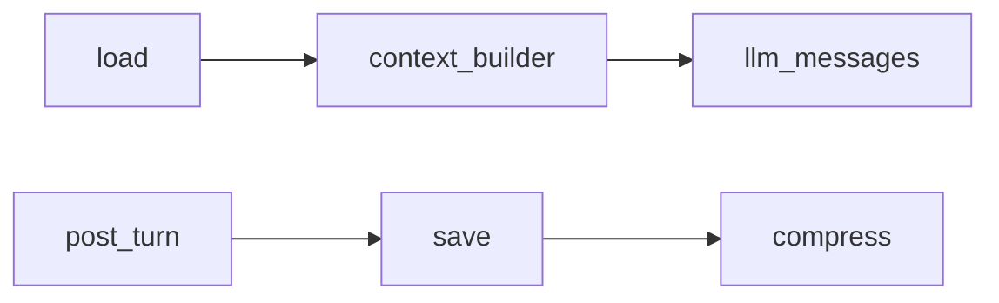

# 会话记忆

## 模块职责

Redis 热缓存 + MySQL 持久化；超 token 阈值压缩摘要。类比 Redis Cache + JPA Repository + 定时压缩任务。

## 核心类 / 文件

- `session_memory_service`
- `context_builder.build_agent_messages`
- `post_turn_service`
- `compress_service`
- `token_estimator`

## 调用链（自上而下）

1. `build_context: session_memory.load → context_builder.build_agent_messages → prompt_service`
1. `post_turn: post_turn_service.run → session_memory.save`
1. `compress: token_estimator 超阈值 → compress_service (LLM 摘要) → assistant_condense`
1. `startup: main.lifespan → session_memory.ensure_table`

## 调用链图

## 外部依赖

- Redis
- MySQL agent_session_memory
- memory LLM

## 说明

Python 模块：async≈CompletableFuture，dict≈Map，本文件描述模块间**调用链**，代码内 `# [zh]` 为逐行注释。

