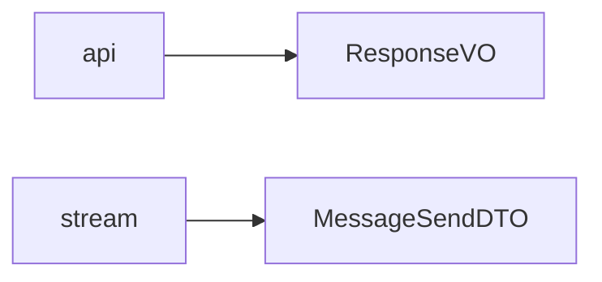

# DTO 模型

## 模块职责

ResponseVO、MessageSendDTO。类比 Java VO/DTO。

## 核心类 / 文件

- `response.py`
- `message_send.py`

## 调用链（自上而下）

1. `api/routes → success/error → ResponseVO`
1. `stream_service → MessageSendDTO → redis publish_ws`

## 调用链图

## 外部依赖

## 说明

Python 模块：async≈CompletableFuture，dict≈Map，本文件描述模块间**调用链**，代码内 `# [zh]` 为逐行注释。

