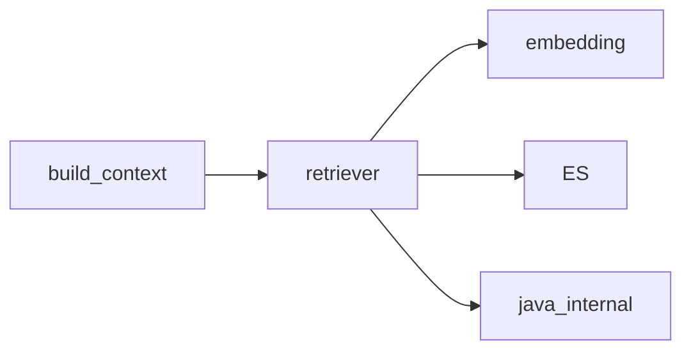

# RAG 检索增强

## 模块职责

FAQ/知识库向量检索 + Java 搜索 API + RRF 融合。

## 核心类 / 文件

- `retriever.search_faq`
- `embedding.embed_text`
- `rrf 融合`

## 调用链（自上而下）

1. `build_context_node → rag_retriever.search_faq`
1. `embed_text → DashScope Embedding (circuit_breaker 保护)`
1. `hybrid → java_internal + ES vector + rrf`

## 调用链图

## 外部依赖

- Embedding API
- Elasticsearch
- circuit_breaker

## 说明

Python 模块：async≈CompletableFuture，dict≈Map，本文件描述模块间**调用链**，代码内 `# [zh]` 为逐行注释。

