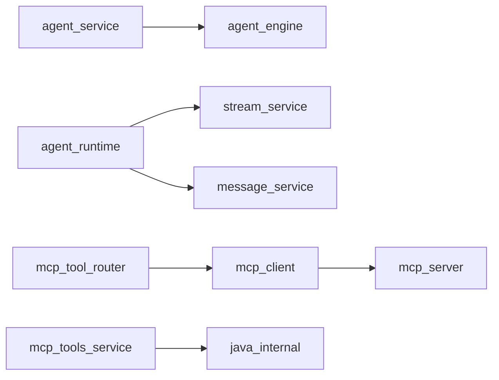

# 业务服务层

## 模块职责

Agent 编排、LLM 运行时、消息持久化、Redis、MCP 路由、Java 内部 API。类比 Spring `@Service` 层。

## 核心类 / 文件

- `agent_service — 编排入口`
- `agent_engine — 调 Graph`
- `agent_runtime — 流式/最终化`
- `mcp_tool_router — 工具分发`
- `java_internal_client — 读 Java`
- `action_execute_service — 写 Java`
- `product_service — 商品搜索`
- `pending_action_service — 确认 token`

## 调用链（自上而下）

1. `send_message: agent_service → message_service + redis + product_snapshot → agent_engine`
1. `LLM: agent_runtime.bind_agent_llm → llm_factory + mcp/tools.build_mcp_tools`
1. `流式: stream_llm_turn → stream_service.push_chunk → redis publish → WS`
1. `工具: mcp_tool_router.invoke → mcp_streamable_client → MCP 进程 → mcp_tools_service → java_internal_client`
1. `确认: pending_action_service (Redis NX) → confirm → action_execute_service → httpx POST java`
1. `商品兜底: product_service.search_products → java_internal + ES hybrid`

## 调用链图

## 外部依赖

- Redis
- MySQL
- LLM API
- MCP :7060
- Java Gateway

## 说明

Python 模块：async≈CompletableFuture，dict≈Map，本文件描述模块间**调用链**，代码内 `# [zh]` 为逐行注释。

