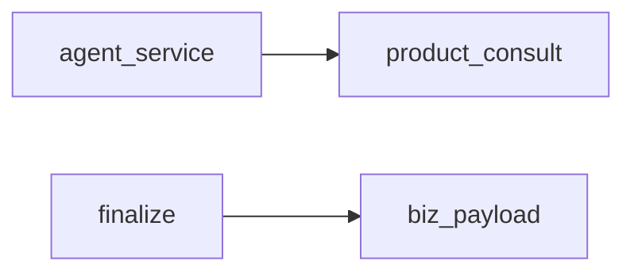

# 无状态工具库

## 模块职责

卡片 JSON、订单号抽取、Prompt 边界、WS Token。类比 Java util / helper 包。

## 核心类 / 文件

- `product_consult`
- `biz_payload`
- `order_ids`
- `prompt_boundary`
- `ws_token`

## 调用链（自上而下）

1. `agent_service → product_consult.parse_consult_card`
1. `context_builder → prompt_boundary.isolate_user_message`
1. `nodes/finalize → biz_payload / order_ids`
1. `websocket → ws_token.resolve_ws_token`

## 调用链图

## 外部依赖

## 说明

Python 模块：async≈CompletableFuture，dict≈Map，本文件描述模块间**调用链**，代码内 `# [zh]` 为逐行注释。

