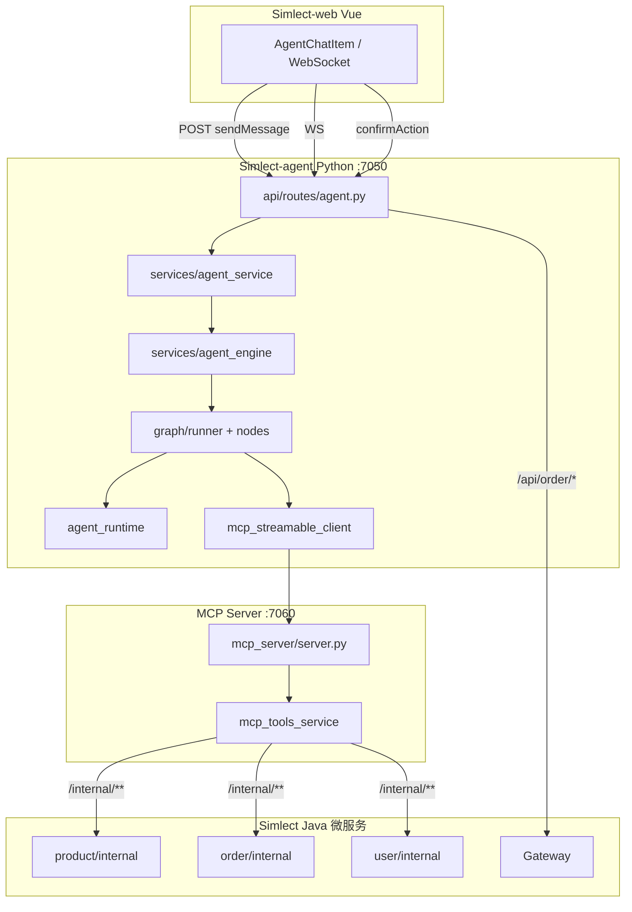
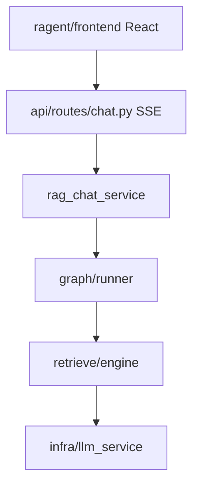

# Simlect + Ragent 全栈调用链总览

## Simlect 商城 + Agent

## Ragent RAG

## 各模块详细文档

- Simlect-agent: 各 `app/*/MODULE.md`
- ragent-python: 各 `app/*/MODULE.md`
- Simlect Java: 各 `Simlect-*/MODULE.md`
- Ragent Java: `bootstrap/`, `infra-ai/`, `mcp-server/` 下 `MODULE.md`

生成命令: `python Simlect-agent/tools/generate_module_docs.py`
