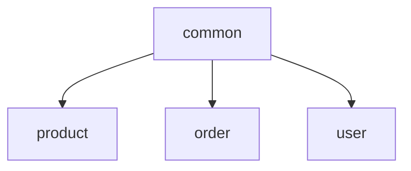

# 公共模块

## 模块职责

实体、枚举、ResponseVO、MQ 常量、Redis 组件、通用异常。被各微服务依赖。

## 核心类 / 文件

- `entity/po`
- `entity/vo/ResponseVO`
- `constants`
- `component/RedisComponent`

## 调用链（自上而下）

1. `各微服务 pom 依赖 common`
1. `Controller 返回 ResponseVO<T>`
1. `ReliableMessageSender / TransactionalMqSender 跨服务消息`

## 调用链图

## 外部依赖

