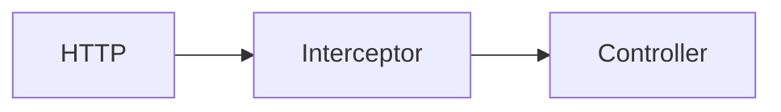

# src / interceptor — interceptor

## 模块职责

MVC 拦截器：登录校验、日志、限流。

## 核心类 / 文件

- `AppInterceptor.java`
- `WebAppConfigurer.java`

## 调用链（自上而下）

1. `HTTP → Interceptor.preHandle → Controller`

## 调用链图

## 外部依赖

- 无额外外部依赖
