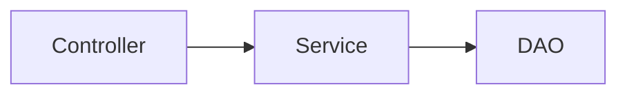

# src / service/impl — service

## 模块职责

业务服务接口与实现（Ragent 命名习惯）。

## 核心类 / 文件

- `MqCompensationLogServiceImpl.java`
- `OutboxMessageServiceImpl.java`

## 调用链（自上而下）

1. `Controller → Service 接口`
1. `ServiceImpl → DAO/Mapper → 外部 LLM/向量库`

## 调用链图

## 外部依赖

- Spring
- PostgreSQL
