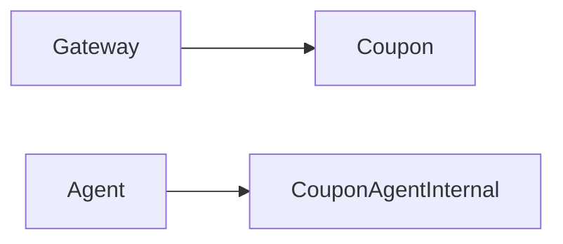

# 优惠券服务

## 模块职责

发券、抢券、核销；Agent 内部查券。

## 核心类 / 文件

- `CouponApplication`
- `CouponAgentInternalController`

## 调用链（自上而下）

1. `Gateway → CouponController → DiscountCouponService`
1. `Agent 内部接口读用户券列表`

## 调用链图

## 外部依赖

- MySQL
- Redis

