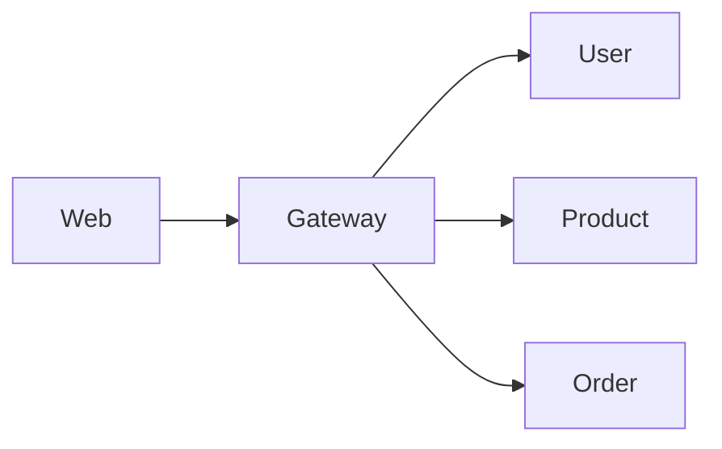

# API 网关

## 模块职责

Spring Cloud Gateway：路由、鉴权、限流入口。所有前端请求第一站。

## 核心类 / 文件

- `GatewayApplication`
- `路由配置 application.yml`

## 调用链（自上而下）

1. `浏览器/前端 → Gateway :端口`
1. `Gateway → 路由规则 → Simlect-user/product/order/pay/coupon/search`
1. `Agent Python 直连或经 Gateway 调 Java /internal/**`

## 调用链图

## 外部依赖

- Nacos/配置
- 下游微服务

