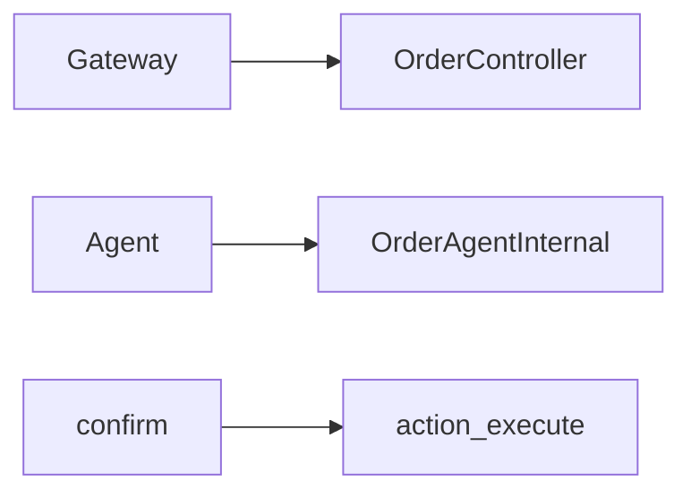

# 订单服务

## 模块职责

下单、支付回调、物流、评价；Agent 查单与写操作桥接。

## 核心类 / 文件

- `OrderApplication`
- `OrderAgentInternalController`
- `OrderInfoServiceImpl`

## 调用链（自上而下）

1. `用户下单: Gateway → OrderController → OrderInfoService → MQ/库存/优惠券`
1. `Agent 查单: MCP tool_query_orders → java_internal → OrderAgentInternalController`
1. `Agent 确认: confirmAction → action_execute_service → Gateway /api/order/refund 等`

## 调用链图

## 外部依赖

- MySQL
- RabbitMQ
- Redis

