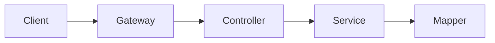

# src / controller — controller

## 模块职责

REST 控制器层，接收 HTTP 请求、参数校验、调用 Service、返回 ResponseVO。类比 Spring `@RestController`。

## 核心类 / 文件

- `CommentReportController.java`
- `OrderCommentController.java`
- `OrderController.java`

## 调用链（自上而下）

1. `客户端/前端 → Gateway（可选）→ `@RequestMapping` Controller 方法`
1. `Controller → `@Resource` Service / Mapper`
1. `Service 返回 VO/DTO → ResponseVO.success(data) → JSON 响应`

## 调用链图

## 外部依赖

- Spring Web
- ResponseVO
- Jakarta Validation
