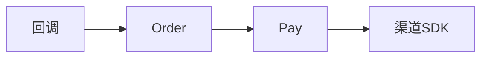

# 支付服务

## 模块职责

支付宝/微信渠道、支付单、回调通知。

## 核心类 / 文件

- `PayApplication`
- `PayInfoService`

## 调用链（自上而下）

1. `Checkout → Gateway → PayController → 渠道 SDK`
1. `支付回调 → 更新订单状态 → MQ`

## 调用链图

## 外部依赖

- 支付宝/微信 SDK
- MySQL

