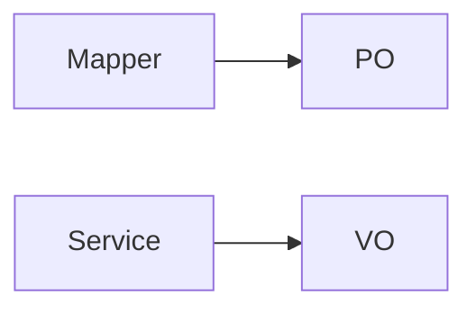

# src / entity/query — entity

## 模块职责

实体与查询对象：PO 持久化对象、Query 查询条件、VO 视图对象。

## 核心类 / 文件

- `PayTradeRecordQuery.java`

## 调用链（自上而下）

1. `Mapper 结果映射 → PO`
1. `Controller 入参 → Query/DTO → Service`
1. `Service 组装 → VO → ResponseVO`

## 调用链图

## 外部依赖

- 无额外外部依赖
