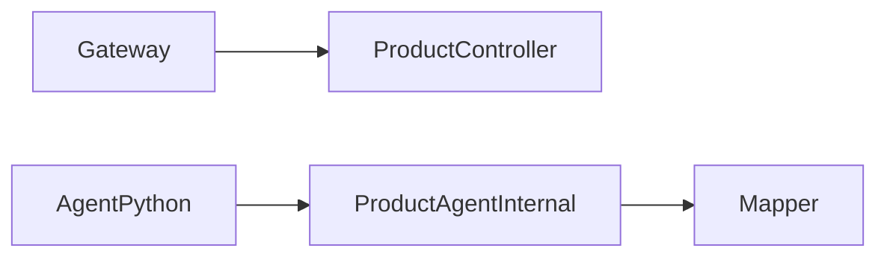

# 商品服务

## 模块职责

商品 CRUD、SKU、分类、库存查询；Agent 内部读接口 ProductAgentInternalController。

## 核心类 / 文件

- `ProductApplication`
- `ProductAgentInternalController`
- `ProductInfoServiceImpl`
- `ProductInternalService`

## 调用链（自上而下）

1. `C 端: Gateway → ProductController → ProductInfoService → Mapper → MySQL`
1. `Agent: python java_internal_client → POST /internal/agent/product/* → ProductAgentInternalController`
1. `Agent 热销/搜索: search/hotSale → ProductInfoMapper (orderBy total_sale)`

## 调用链图

## 外部依赖

- MySQL
- Redis 缓存
- MQ 同步搜索/RAG

