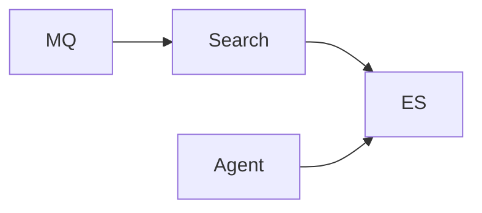

# 搜索服务

## 模块职责

Elasticsearch 商品/FAQ 索引与检索；Agent RAG 也会调 ES。

## 核心类 / 文件

- `SearchApplication`
- `搜索 Controller/Service`

## 调用链（自上而下）

1. `商品变更 MQ → 同步 ES 索引`
1. `Agent rag/retriever → ES vector + keyword`
1. `商城搜索 Portal → Gateway → Search`

## 调用链图

## 外部依赖

- Elasticsearch

