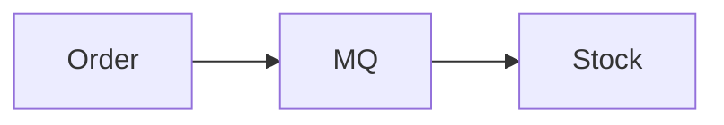

# 库存服务

## 模块职责

SKU 库存扣减/回滚；下单链路依赖。

## 核心类 / 文件

- `StockApplication`

## 调用链（自上而下）

1. `下单 → Order → MQ → Stock 扣减`
1. `取消/退款 → 库存回滚`

## 调用链图

```mermaid
flowchart LR
  Order --> MQ --> Stock
```

## 外部依赖

- MySQL
- RabbitMQ

