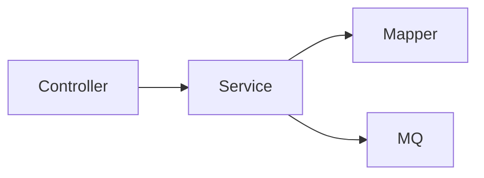

# src / biz — biz

## 模块职责

业务服务层（接口 + impl），封装领域逻辑、事务、MQ 发送。类比 Spring `@Service`。

## 核心类 / 文件

- `SkuStockService.java`

## 调用链（自上而下）

1. `Controller → XxxService 接口`
1. `XxxServiceImpl → Mapper 读写 → 业务校验 → 返回实体/VO`
1. `写操作 → `@Transactional` → MQ / Redis 副作用`

## 调用链图

## 外部依赖

- MyBatis
- RabbitMQ
- Redis
