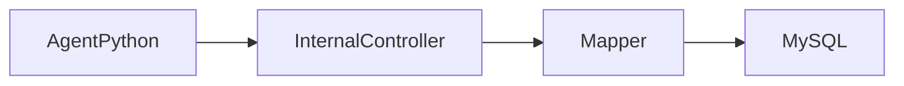

# src / controller/internal — controller.internal

## 模块职责

内部 Agent 专用接口（`/internal/**`），供 Simlect-agent Python 通过 java_internal_client 调用，不对外暴露。

## 核心类 / 文件

- `StockInternalController.java`

## 调用链（自上而下）

1. `Simlect-agent MCP → mcp_tools_service → java_internal_client.post_json`
1. `→ 本包 `*AgentInternalController` → Mapper → MySQL`
1. `→ toXxxMap/toAgentCard → ResponseVO → Agent 卡片 JSON`

## 调用链图

## 外部依赖

- Simlect-agent
- MySQL
