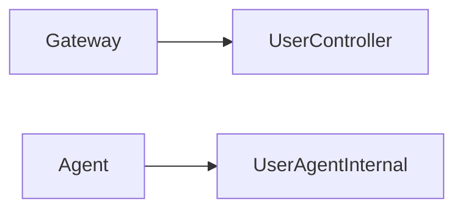

# 用户服务

## 模块职责

登录注册、会员、收藏浏览、签到；Agent 查优惠券/用户信息。

## 核心类 / 文件

- `UserApplication`
- `UserAgentInternalController`

## 调用链（自上而下）

1. `Gateway → UserController → 各 Service → Mapper`
1. `Agent: QUERY_USER_COUPONS → UserAgentInternalController`

## 调用链图

## 外部依赖

- MySQL
- Redis Token

