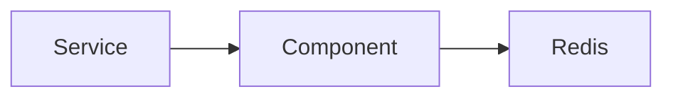

# src / component — component

## 模块职责

可复用 Spring 组件：Redis、MQ 发送、远程补偿记录等。

## 核心类 / 文件

- `AdminLoginLockService.java`
- `BaiduImageCensorComponent.java`
- `ImageCensorRateLimitService.java`
- `NotifyPushPublisher.java`
- `RabbitMQBrowseListenerComponent.java`
- `RabbitMQNotifyListenerComponent.java`
- `RabbitMQUserTempBanListenerComponent.java`
- `SignRecordListenerComponent.java`
- `UserTempBanService.java`

## 调用链（自上而下）

1. `Service → `@Resource` Component`
1. `Component → Redis / RabbitMQ / HTTP 客户端`

## 调用链图

## 外部依赖

- Redis
- RabbitMQ
