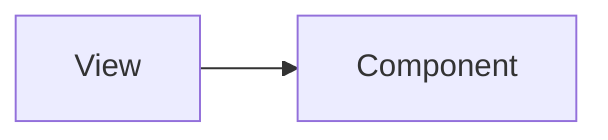

# Simlect-admin / views/home

## 模块职责

可复用 UI 组件，被 views 或其他 components 引用。

## 核心类 / 文件

- `Home.vue`
- `LessStockData.vue`
- `SaleData.vue`
- `ShippedOrder.vue`
- `TodayData.vue`
- `WeeklyData.vue`

## 调用链（自上而下）

1. `父 View/Component → import 子组件 → props/emits 通信`

## 调用链图

## 外部依赖

- 无额外外部依赖
