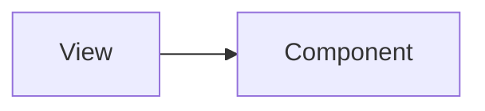

# Simlect-admin / views/setting

## 模块职责

可复用 UI 组件，被 views 或其他 components 引用。

## 核心类 / 文件

- `AgentMessageList.vue`
- `HandleImageModeration.vue`
- `ImageModerationList.vue`
- `Logistics.vue`
- `Prompt.vue`
- `Rag.vue`
- `RagEdit.vue`
- `SensitiveWord.vue`

## 调用链（自上而下）

1. `父 View/Component → import 子组件 → props/emits 通信`

## 调用链图

## 外部依赖

- 无额外外部依赖
