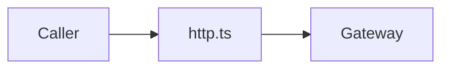

# Simlect-web / api

## 模块职责

HTTP API 封装模块，统一 axios 实例与后端路径。

## 核心类 / 文件

- `http.ts`
- `location.ts`
- `memberCenter.ts`
- `modules.ts`

## 调用链（自上而下）

1. `store/view → api/modules.ts 或 http.ts`
1. `http 拦截器附加 token → Gateway → 微服务`

## 调用链图

## 外部依赖

- Axios
