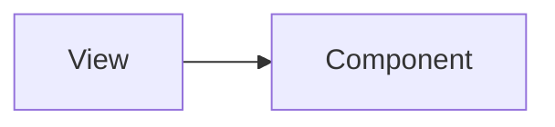

# Simlect-web / components/layout

## 模块职责

可复用 UI 组件，被 views 或其他 components 引用。

## 核心类 / 文件

- `AppFooter.vue`
- `HomeSearchHeader.vue`
- `MobileTabBar.vue`
- `PageBackBar.vue`
- `PcAuthShell.vue`
- `PcFloatToolbar.vue`
- `PcUserSidebar.vue`
- `SiteHeader.vue`
- `TabPageHeader.vue`

## 调用链（自上而下）

1. `父 View/Component → import 子组件 → props/emits 通信`

## 调用链图

## 外部依赖

- 无额外外部依赖
