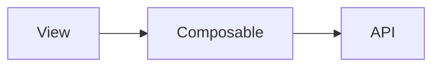

# Simlect-web / composables

## 模块职责

Vue 组合式函数（Composition API），封装可复用逻辑。

## 核心类 / 文件

- `agentEmbed.ts`
- `imagePreview.ts`
- `pullRefresh.ts`
- `useAgentSession.ts`
- `useAppWebSocket.ts`
- `useCheckoutPage.ts`
- `useDevice.ts`
- `useEmailCode.ts`
- `useFeatureRegistry.ts`
- `useImageLightboxZoom.ts`
- `useInfiniteScroll.ts`
- `useOpenAgent.ts`

## 调用链（自上而下）

1. `View setup() → useXxx() composable`
1. `composable → ref/computed/watch → 副作用 api 调用`

## 调用链图

## 外部依赖

- 无额外外部依赖
