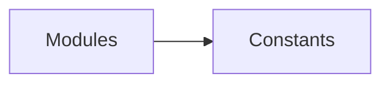

# Simlect-web / constants

## 模块职责

前端常量：枚举映射、Tab 页配置、校验规则等。

## 核心类 / 文件

- `backendEnums.ts`
- `member.ts`
- `payChannel.ts`
- `pcUserNav.ts`
- `searchHotWords.ts`
- `tabPages.ts`
- `validation.ts`

## 调用链（自上而下）

1. `modules import constants → 避免硬编码`

## 调用链图

## 外部依赖

- 无额外外部依赖
