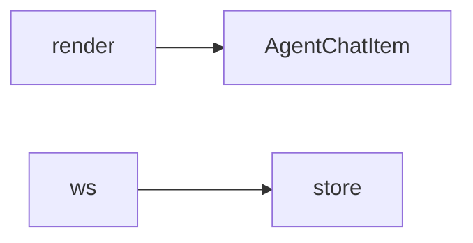

# 前端工具（Agent 相关）

## 模块职责

消息渲染、商品咨询、WebSocket。

## 核心类 / 文件

- `agentMessageRender.ts`
- `agentProductConsult.ts`
- `websocket/manager.ts`

## 调用链（自上而下）

1. `AgentChatItem → agentMessageRender 解析 JSON/intro`
1. `发送消息 → build consult card → agentProductConsult`
1. `websocket/manager 连接 /ws + 心跳`

## 调用链图

## 外部依赖

