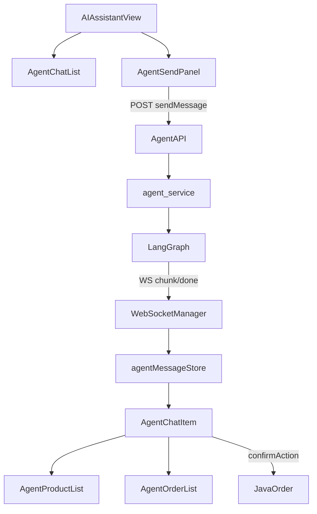

# Simlect-web / views/agent — AI 助手页面

## 模块职责

商城 AI 助手对话页面：消息列表、发送面板、与 Simlect-agent Python 后端通过 HTTP + WebSocket 通信。

## 核心文件

- `AgentChatList.vue` — 消息列表容器
- `AgentSendPanel.vue` — 输入框、发送、商品咨询卡片附带
- `AIAssistantView.vue` / `pc/PcAIAssistantView.vue` — 移动端/PC 端入口页

## 调用链（完整）

1. `router/index.ts` → `/ai-assistant` → `AIAssistantView.vue`
2. `AIAssistantView` → `AgentChatList` + `AgentSendPanel`
3. 用户发送 → `stores/agentMessage.ts` → `POST /api/agent/sendMessage`（Gateway → Simlect-agent）
4. HTTP 返回 `messageId` → 等待 WebSocket 流式 chunk
5. `utils/websocket/manager.ts` 连接 `/ws` → Redis Pub/Sub 下行
6. `push_chunk` / `push_done` → store 更新 → `AgentChatItem.vue` 渲染
7. 商品/订单/确认卡片 → `utils/agentMessageRender.ts` 按 `biz_type` 分支
8. 用户点确认 → `POST /api/agent/confirmAction` → Java 订单写 API

## 调用链图

## 外部依赖

- Simlect-agent Python (:7050)
- Simlect-gateway
- WebSocket `/ws`

## 相关文档

- `components/agent/MODULE.md`
- `stores/MODULE.md`（agentMessage）
- `Simlect-agent/app/api/MODULE.md`
