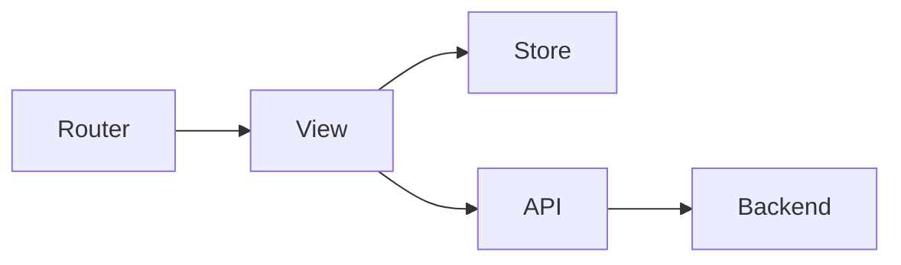

# Simlect-web / views/pc

## 模块职责

页面级 Vue 组件，由 vue-router 路由加载。

## 核心类 / 文件

- `PcAIAssistantView.vue`
- `PcAccountManageView.vue`
- `PcAccountProfileView.vue`
- `PcAddressView.vue`
- `PcCartView.vue`
- `PcCheckoutView.vue`
- `PcCouponsView.vue`
- `PcFootprintView.vue`
- `PcHomeView.vue`
- `PcMyCouponsView.vue`
- `PcOrdersView.vue`
- `PcPaymentView.vue`

## 调用链（自上而下）

1. `router/index.ts 路由表 → path → View 组件`
1. `View → composables/stores → api/* → Gateway 后端`
1. `响应 → 渲染模板 / 跳转`

## 调用链图

## 外部依赖

- Vue Router
- Pinia
- Axios
